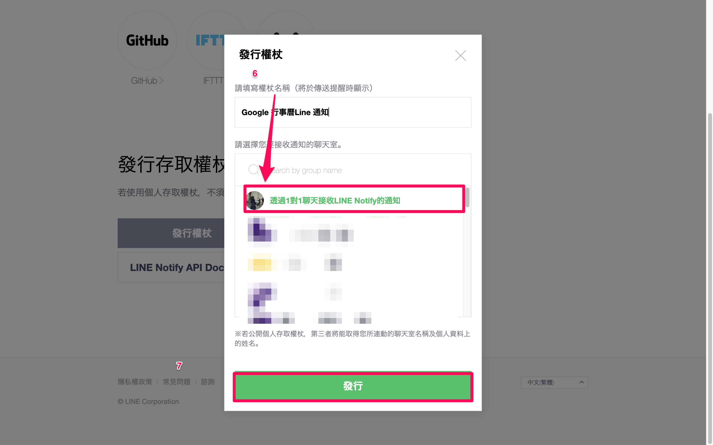
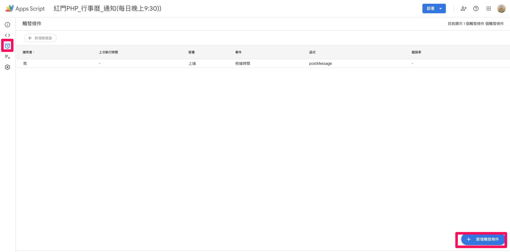

# Line-Notify_X_Google_Calendar

此程式為串接 Google Calendar 與 Line Notify 的程式碼，其目的在於將隔日行事曆在每日晚上定期發送通知到 LIne，作為個人管控以及工作事項之目的。
## 建立步驟
### 1. 取得 Line Notify Token 
#### 1-1 登入 [Line Notify](https://notify-bot.line.me/zh_TW/) 

#### 1-2 輸入自己的 Line 登入的帳號密碼

#### 1-3 點擊個人頁面

#### 1-4 點選發行權杖

#### 1-5 選擇通知聊天室

#### 1-6 紀錄Token

### 2. 建立Google App Script 專案
#### 2-1 進入 [Google App Scripts](https://www.google.com/script/start/) 頁面裡，點選 Google Apps Script

#### 2-2 建立新專案

#### 2-3 專案命名

#### 2-4 點選專案設定，設定時區

#### 2-5 點擊 <> 撰寫相關程式碼 ，為Line_Notify_Google_Canendar.js 此檔案內容。

#### 2-6 設定觸發條件

